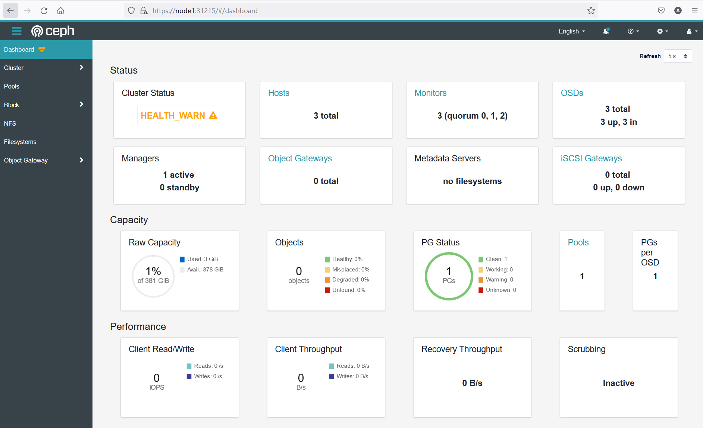
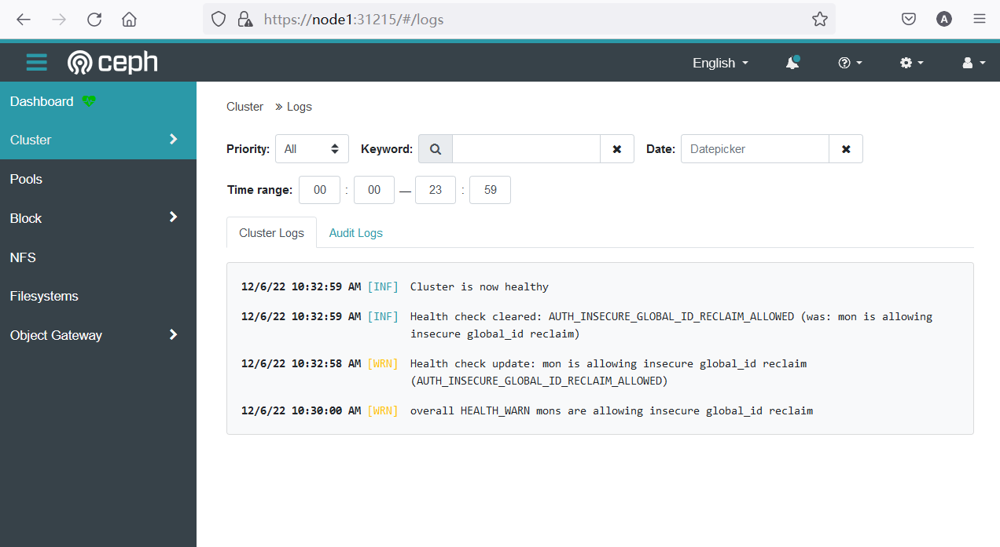
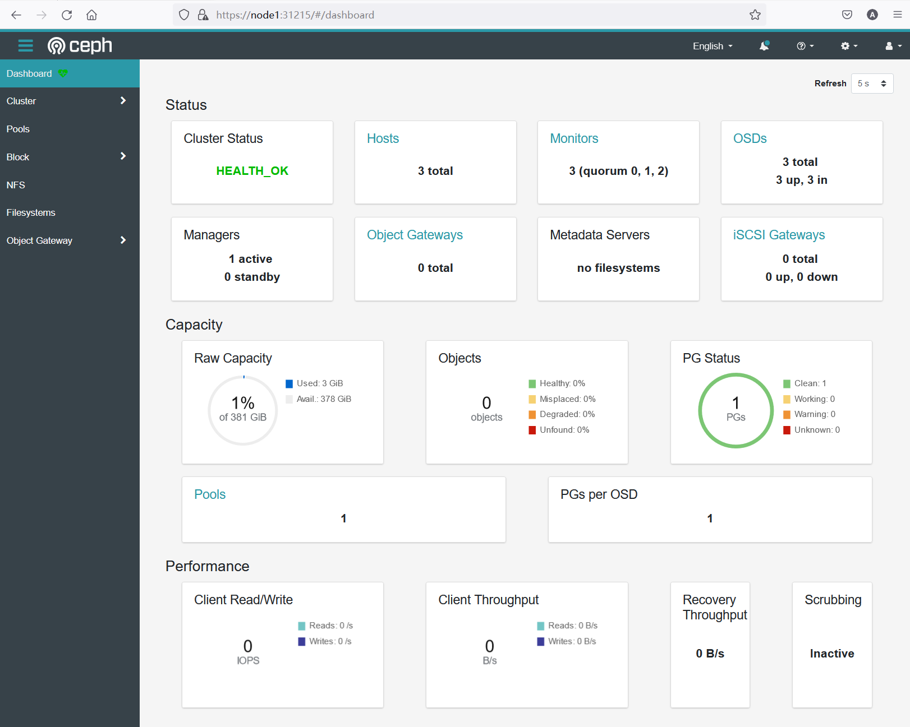

# 安装Rook

本次实验的环境：

- 服务器数量：三台
- 服务器OS：Ubuntu 20.04
- 服务器硬件配置：4C8G双硬盘
- K8S版本：1.23.0


因为三台机器都要承担工作负载，因此需要去掉master上的污点

```bash
kubectl taint nodes --all node-role.kubernetes.io/master-
```


检查服务器磁盘配置

```bash
lsblk -f
```


```bash
root@node1:~# lsblk -f
NAME   FSTYPE LABEL UUID                                 FSAVAIL FSUSE% MOUNTPOINT
fd0
sda
└─sda1 ext4         bbd3ea56-da3b-4e1a-b14e-159e41299ea3    112G     6% /
sdb
sr0
```

如输出所示,sdb为一块未格式化的裸盘,用户后续ceph群集的搭建


下载Rook Repo

```bash
git clone --single-branch --branch v1.6.3 https://github.com/rook/rook.git
```


```bash
cd rook/cluster/examples/kubernetes/ceph
```


修改 operator.yaml

```bash
nano operator.yaml
```


启用自动发现

```bash
  # This daemon does not need to run if you are only going to create your OSDs based on StorageClassDeviceSets with PVCs.
  ROOK_ENABLE_DISCOVERY_DAEMON: "true" #修改为true
```


使用国内镜像

```
  # these images to the desired release of the CSI driver.
  # ROOK_CSI_CEPH_IMAGE: "quay.io/cephcsi/cephcsi:v3.3.1"
  # ROOK_CSI_REGISTRAR_IMAGE: "k8s.gcr.io/sig-storage/csi-node-driver-registrar:v2.0.1"
  # ROOK_CSI_RESIZER_IMAGE: "k8s.gcr.io/sig-storage/csi-resizer:v1.0.1"
  # ROOK_CSI_PROVISIONER_IMAGE: "k8s.gcr.io/sig-storage/csi-provisioner:v2.0.4"
  # ROOK_CSI_SNAPSHOTTER_IMAGE: "k8s.gcr.io/sig-storage/csi-snapshotter:v4.0.0"
  # ROOK_CSI_ATTACHER_IMAGE: "k8s.gcr.io/sig-storage/csi-attacher:v3.0.2"
```

替换为

```
ROOK_CSI_REGISTRAR_IMAGE: "registry.cn-beijing.aliyuncs.com/dotbalo/csi-node-driver-registrar:v2.0.1"
ROOK_CSI_RESIZER_IMAGE: "registry.cn-beijing.aliyuncs.com/dotbalo/csi-resizer:v1.0.1"
ROOK_CSI_PROVISIONER_IMAGE: "registry.cn-beijing.aliyuncs.com/dotbalo/csi-provisioner:v2.0.4"
ROOK_CSI_SNAPSHOTTER_IMAGE: "registry.cn-beijing.aliyuncs.com/dotbalo/csi-snapshotter:v4.0.0"
ROOK_CSI_ATTACHER_IMAGE: "registry.cn-beijing.aliyuncs.com/dotbalo/csi-attacher:v3.0.2"
```


部署rook

```bash
kubectl create -f crds.yaml -f common.yaml -f operator.yaml
```


查看创建的crd

```
kubectl get crd | grep rook
```


```bash
root@node1:~/rook/cluster/examples/kubernetes/ceph# kubectl get crd | grep rook
cephblockpools.ceph.rook.io                                 2022-12-06T01:22:46Z
cephclients.ceph.rook.io                                    2022-12-06T01:22:46Z
cephclusters.ceph.rook.io                                   2022-12-06T01:22:46Z
cephfilesystemmirrors.ceph.rook.io                          2022-12-06T01:22:46Z
cephfilesystems.ceph.rook.io                                2022-12-06T01:22:46Z
cephnfses.ceph.rook.io                                      2022-12-06T01:22:46Z
cephobjectrealms.ceph.rook.io                               2022-12-06T01:22:46Z
cephobjectstores.ceph.rook.io                               2022-12-06T01:22:46Z
cephobjectstoreusers.ceph.rook.io                           2022-12-06T01:22:46Z
cephobjectzonegroups.ceph.rook.io                           2022-12-06T01:22:46Z
cephobjectzones.ceph.rook.io                                2022-12-06T01:22:46Z
cephrbdmirrors.ceph.rook.io                                 2022-12-06T01:22:46Z
volumes.rook.io                                             2022-12-06T01:22:46Z
```


查看ceph群集信息

```bash
kubectl get cephcluster -n rook-ceph
```


```bash
root@node1:~/rook/cluster/examples/kubernetes/ceph# kubectl get cephcluster -n rook-ceph
No resources found in rook-ceph namespace.
```


查看pod

```bash
kubectl -n rook-ceph get pod
```


```bash
root@node1:~/rook/cluster/examples/kubernetes/ceph# kubectl -n rook-ceph get pod
NAME                                  READY   STATUS    RESTARTS   AGE
rook-ceph-operator-7958854bd7-wbl6x   1/1     Running   0          7m31s
rook-discover-j94xk                   1/1     Running   0          6m49s
rook-discover-p5czf                   1/1     Running   0          6m49s
rook-discover-qvh52                   1/1     Running   0          6m49s
```


创建ceph群集

```bash
kubectl create -f cluster.yaml
```


查看创建过程

```
kubectl get cephcluster -n rook-ceph
```


```bash
root@node1:~/rook/cluster/examples/kubernetes/ceph# kubectl get cephcluster -n rook-ceph
NAME        DATADIRHOSTPATH   MONCOUNT   AGE   PHASE         MESSAGE                  HEALTH   EXTERNAL
rook-ceph   /var/lib/rook     3          54s   Progressing   Detecting Ceph version
```


查看operator日志

```bash
 kubectl logs rook-ceph-operator-7958854bd7-wbl6x -n rook-ceph
```


```bash
2022-12-06 01:35:54.520275 I | op-mgr: successfully set ceph dashboard creds
2022-12-06 01:35:56.130913 I | op-osd: updating OSD 0 on node "node2"
2022-12-06 01:35:56.166867 I | op-osd: OSD orchestration status for node node2 is "completed"
2022-12-06 01:35:56.171823 I | op-osd: OSD orchestration status for node node3 is "orchestrating"
2022-12-06 01:35:58.069999 I | op-osd: updating OSD 1 on node "node3"
2022-12-06 01:35:58.099479 I | op-osd: OSD orchestration status for node node3 is "completed"
2022-12-06 01:35:58.339327 I | op-mgr: dashboard config has changed. restarting the dashboard module
2022-12-06 01:35:58.339436 I | op-mgr: restarting the mgr module
2022-12-06 01:35:59.347193 I | op-osd: updating OSD 2 on node "node1"
2022-12-06 01:36:00.266395 I | cephclient: successfully disallowed pre-octopus osds and enabled all new octopus-only functionality
2022-12-06 01:36:00.266434 I | op-osd: finished running OSDs in namespace "rook-ceph"
2022-12-06 01:36:00.266442 I | ceph-cluster-controller: done reconciling ceph cluster in namespace "rook-ceph"
2022-12-06 01:36:00.539515 I | op-mgr: successful modules: dashboard
```


确认群集安装状态

```
kubectl get cephcluster -n rook-ceph
```


```bash
root@node1:~/rook/cluster/examples/kubernetes/ceph# kubectl get cephcluster -n rook-ceph
NAME        DATADIRHOSTPATH   MONCOUNT   AGE   PHASE   MESSAGE                        HEALTH        EXTERNAL
rook-ceph   /var/lib/rook     3          13m   Ready   Cluster created successfully   HEALTH_WARN

```


查看pod

```
kubectl get pod -n rook-ceph
```


```bash
root@node1:~/rook/cluster/examples/kubernetes/ceph# kubectl get pod -n rook-ceph
NAME                                              READY   STATUS      RESTARTS   AGE
csi-cephfsplugin-77g4f                            3/3     Running     0          4m55s
csi-cephfsplugin-cn9cc                            3/3     Running     0          4m55s
csi-cephfsplugin-cxd82                            3/3     Running     0          4m55s
csi-cephfsplugin-provisioner-7594b68bcb-2t575     6/6     Running     0          4m55s
csi-cephfsplugin-provisioner-7594b68bcb-wwn2j     6/6     Running     0          4m55s
csi-rbdplugin-2v2fc                               3/3     Running     0          4m56s
csi-rbdplugin-nntm2                               3/3     Running     0          4m56s
csi-rbdplugin-provisioner-757bdc7649-4qrtz        6/6     Running     0          4m56s
csi-rbdplugin-provisioner-757bdc7649-tlwcc        6/6     Running     0          4m56s
csi-rbdplugin-px7rf                               3/3     Running     0          4m56s
rook-ceph-crashcollector-node1-59767675f6-8dv7p   1/1     Running     0          3m9s
rook-ceph-crashcollector-node2-5f9466c4df-xl2g9   1/1     Running     0          3m20s
rook-ceph-crashcollector-node3-6c68cb765d-mjnp2   1/1     Running     0          3m20s
rook-ceph-mgr-a-7bf8f98c4b-4hsbm                  1/1     Running     0          3m23s
rook-ceph-mon-a-74558fc57d-wstvp                  1/1     Running     0          4m7s
rook-ceph-mon-b-84fc75c787-zwhcl                  1/1     Running     0          4m
rook-ceph-mon-c-6d46b45cb8-fbj4k                  1/1     Running     0          3m50s
rook-ceph-operator-7958854bd7-wbl6x               1/1     Running     0          15m
rook-ceph-osd-0-5b4699757c-nfprg                  1/1     Running     0          3m10s
rook-ceph-osd-1-86549d7674-8pw2g                  1/1     Running     0          3m10s
rook-ceph-osd-2-57ccd6fdb8-gbkdg                  1/1     Running     0          3m9s
rook-ceph-osd-prepare-node1-7zn7h                 0/1     Completed   0          2m51s
rook-ceph-osd-prepare-node2-9tpvj                 0/1     Completed   0          2m49s
rook-ceph-osd-prepare-node3-f6hf9                 0/1     Completed   0          2m47s
rook-discover-j94xk                               1/1     Running     0          15m
rook-discover-p5czf                               1/1     Running     0          15m
rook-discover-qvh52                               1/1     Running     0          15m
```


查看服务

```bash
kubectl get svc -n rook-ceph
```


```bash
root@node1:~/rook/cluster/examples/kubernetes/ceph# kubectl get svc -n rook-ceph
NAME                       TYPE        CLUSTER-IP       EXTERNAL-IP   PORT(S)             AGE
csi-cephfsplugin-metrics   ClusterIP   10.106.215.152   <none>        8080/TCP,8081/TCP   9m39s
csi-rbdplugin-metrics      ClusterIP   10.97.66.233     <none>        8080/TCP,8081/TCP   9m39s
rook-ceph-mgr              ClusterIP   10.109.198.134   <none>        9283/TCP            8m4s
rook-ceph-mgr-dashboard    ClusterIP   10.101.144.82    <none>        8443/TCP            8m4s
rook-ceph-mon-a            ClusterIP   10.101.130.249   <none>        6789/TCP,3300/TCP   8m52s
rook-ceph-mon-b            ClusterIP   10.106.237.229   <none>        6789/TCP,3300/TCP   8m45s
rook-ceph-mon-c            ClusterIP   10.102.106.129   <none>        6789/TCP,3300/TCP   8m35s
```


安装ceph客户端工具

```bash
kubectl  create -f toolbox.yaml -n rook-ceph
```


查看ceph tools pod

```bash
 kubectl get pod -n rook-ceph | grep tools
```


```bash
root@node1:~/rook/cluster/examples/kubernetes/ceph# kubectl get pod -n rook-ceph | grep tools
rook-ceph-tools-5f6c9f465-8lr4x                   1/1     Running     0          3m45s
```


使用tools pod执行ceph状态检查命令

```bash
kubectl -n rook-ceph exec -it deploy/rook-ceph-tools -- bash
```


```
ceph status
ceph osd status
ceph df
rados df
```


```bash
root@node1:~/rook/cluster/examples/kubernetes/ceph# kubectl -n rook-ceph exec -it deploy/rook-ceph-tools -- bash
[root@rook-ceph-tools-5f6c9f465-8lr4x /]# ceph status
  cluster:
    id:     c4a85273-6a13-4449-b05d-3ffde2fc6042
    health: HEALTH_WARN
            mons are allowing insecure global_id reclaim

  services:
    mon: 3 daemons, quorum a,b,c (age 19m)
    mgr: a(active, since 19m)
    osd: 3 osds: 3 up (since 19m), 3 in (since 19m)

  data:
    pools:   1 pools, 1 pgs
    objects: 0 objects, 0 B
    usage:   3.0 GiB used, 378 GiB / 381 GiB avail
    pgs:     1 active+clean
```


```bash
[root@rook-ceph-tools-5f6c9f465-8lr4x /]# ceph osd status
ID  HOST    USED  AVAIL  WR OPS  WR DATA  RD OPS  RD DATA  STATE
 0  node2  1026M   125G      0        0       0        0   exists,up
 1  node3  1026M   125G      0        0       0        0   exists,up
 2  node1  1026M   125G      0        0       0        0   exists,up
```


```bash
[root@rook-ceph-tools-5f6c9f465-8lr4x /]# ceph df
--- RAW STORAGE ---
CLASS  SIZE     AVAIL    USED     RAW USED  %RAW USED
hdd    381 GiB  378 GiB  6.6 MiB   3.0 GiB       0.79
TOTAL  381 GiB  378 GiB  6.6 MiB   3.0 GiB       0.79

--- POOLS ---
POOL                   ID  PGS  STORED  OBJECTS  USED  %USED  MAX AVAIL
device_health_metrics   1    1     0 B        0   0 B      0    120 GiB
```


```bash
[root@rook-ceph-tools-5f6c9f465-8lr4x /]# rados df
POOL_NAME              USED  OBJECTS  CLONES  COPIES  MISSING_ON_PRIMARY  UNFOUND  DEGRADED  RD_OPS   RD  WR_OPS   WR  USED COMPR  UNDER COMPR
device_health_metrics   0 B        0       0       0                   0        0         0       0  0 B       0  0 B         0 B          0 B

total_objects    0
total_used       3.0 GiB
total_avail      378 GiB
total_space      381 GiB
```


配置ceph dashboard

```bash
kubectl apply -f dashboard-external-https.yaml
```


查看dashboard相关服务

```bash
kubectl get svc -n rook-ceph | grep rook-ceph-mgr-dashboard
```


```bash
root@node1:~/rook/cluster/examples/kubernetes/ceph# kubectl get svc -n rook-ceph | grep rook-ceph-mgr-dashboard
rook-ceph-mgr-dashboard                  ClusterIP   10.101.144.82    <none>        8443/TCP            42m
rook-ceph-mgr-dashboard-external-https   NodePort    10.102.110.0     <none>        8443:31215/TCP      113s
```


查看dashboard密码

```bash
kubectl -n rook-ceph get secret rook-ceph-dashboard-password -o jsonpath="{['data']['password']}"|base64 --decode && echo
```


登录到dashboard页面:`https://node1:31215`




消除dashboard中的health_warn

```bash
 kubectl -n rook-ceph exec -it deploy/rook-ceph-tools -- bash
```


```bash
ceph config set mon auth_allow_insecure_global_id_reclaim false
```


```bash
root@node1:~/rook/cluster/examples/kubernetes/ceph# kubectl -n rook-ceph exec -it deploy/rook-ceph-tools -- bash
[root@rook-ceph-tools-5f6c9f465-8lr4x /]# ceph config set mon auth_allow_insecure_global_id_reclaim false
[root@rook-ceph-tools-5f6c9f465-8lr4x /]# ceph -s
  cluster:
    id:     c4a85273-6a13-4449-b05d-3ffde2fc6042
    health: HEALTH_WARN
            mon is allowing insecure global_id reclaim

  services:
    mon: 3 daemons, quorum a,b,c (age 57m)
    mgr: a(active, since 56m)
    osd: 3 osds: 3 up (since 57m), 3 in (since 57m)

  data:
    pools:   1 pools, 1 pgs
    objects: 0 objects, 0 B
    usage:   3.0 GiB used, 378 GiB / 381 GiB avail
    pgs:     1 active+clean
```






